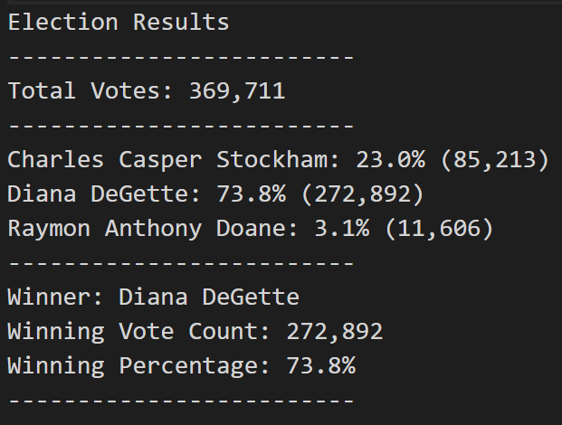
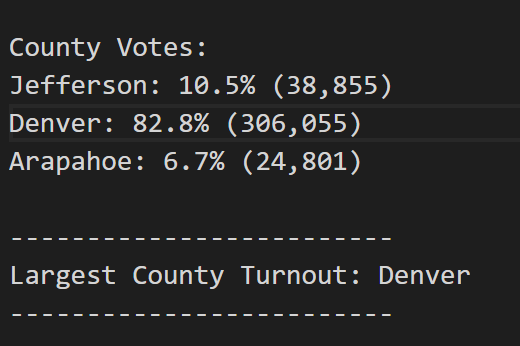

# Election Analysis

## Project Overview
A Colorado Board of Elections employee has given me the following tasks to complete the election audit of a recent local congressional election.

1. Calculate the total number of votes cast.
2. Get a complete list of candidates who received votes.
3. Calculate the total number of votes each candidate received.
4. Calculate the percentage of votes each candidate won.
5. Determine the winner of the election based on popular vote.

## Resources
- Data source: election_results.csv
- Softwarer: Python 3.7.6, Visual Studio Code 1.54.3

## Summary
The analysis of the election shows that:
- There were 369,711 total votes cast in the election
- The candidates were:
  - Charles Casper Stockham
  - Diana DeGette
  - Raymon Anthony Doane
- The candidate results were:
  - Charles Casper Stockham received 23.0% of the vote and 85,213 total votes
  - Diana DeGette received 73.8% of the vote and 272,892 total votes
  - Raymon Anthony Doane received 3.1% of the vote and 11,606 total votes
- The winner of the election was:
  - Candidate Diana DeGette, who received 73.8% of the vote and 272,892 total votes

## Challenge Overview
The Colorado Board of Elections employee has requested additional information on voter turnout per county. They have asked me to complete the following tasks:

1. Calculate the total voter turnout for each county.
2. Calculate the percentage of voters from each county.
3. Determine the county with the highest turnout.

## Challenge Summary
The analysis of the county voter turnout shows that:
- There were 369,711 total votes cast in the election
- Voters from Arapahoe, Denver, and Jefferson county votes
- The voter turnout from each county is:
  - Arapahoe voters accounted for 10.5% of the voter turnout with 38,855 total votes
  - Denver voters accounted for 82.8% of the voter turnout with 306,055 total votes
  - Jefferson voters accounted for 6.7% of the voter turnout with 24,801 total votes
- The county with the highest voter turnout was:
  - Denver county, who accounted for 82.8% of the voter turnout with 306,055 total votes

## Election Audit Summary
This script can be modified for any election. This script can help the Colorado Board of Elections quickly analyze not only the winner of any election, but also where the most amount of voters came from. For example, this script could also be used to see if a proposition has passed by modifying the "candidate" portion of the script. It also could be helpful to see where the least amount of voters were from my modifying the code corresponding to the largest county turnout. This might help the Board of Elections see where they could target to encourage more voters to vote.

